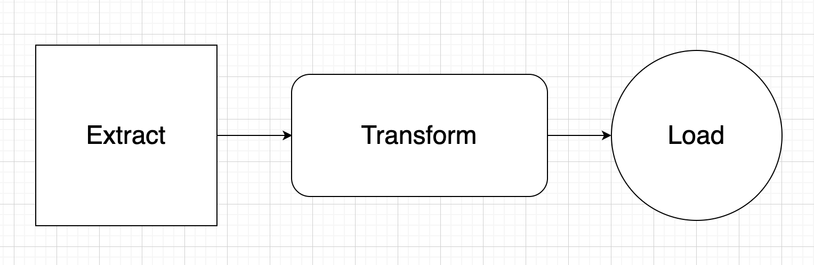

# Airflow Project 1

This project is about using AirFlow and Docker to create an ETL pipeline. I used the Pokemon API to retrieve Pikachu from it as part of the ETL process.

## Agile

I used GitHub project board to create the various tasks, and also the user stories for each of those tasks. I moved the tasks between various columns as part of the Kanban board in Github projects so that I can keep track of which tasks have been done at what point and what is still to be completed. It also helps with keeping the project generally well organised. 

## User Stories

- As a developer I want to do the initial setup and config/yaml of the project to connect to Airflow and Docker so that I am able to start the project.

- As a developer, I should create a basic dag function to begin with so I am then add in what I need within that such as create table.

- As a developer I want to create a table in SQL within my first DAG function so I have a table created and data can be extracted.

- As a developer I want to be able to connect to Postgres database and add the connection to the Airflow UI so my data is connected.

- As a developer I want to retrieve the api so I can extract the relevant data that I need.

- As a developer I want to create the extrract_user function so that I can retrieve the relevant data for my workflow.

- As a developer I want to create the process_users function so I can convert the data to csv.

- As a developer I want to store_users so the relevant data can stored in the Postgres database.

- As a developer I should define the dependencies to determined order of dags so airflow knows the order to execute them.

- As a developer, I should write clear comments above code to explain what it is doing so it is easy for other people reading your code to understand.

- As a user, I expect to see comments above code so that I can easily understand what is going on in the code.

- As a user I want to be able to see the documentation on the readme for the project so I can see the relevant information for the project.

- As a developer, I should provide easy documentation on the project, so that others can understand it easily and see clear documentation.

## Architecture and diagram to show the ETL Pipeline

## Technologies Used
- Airflow
- Docker
- Python

## Initial setup connecting to Airflow/Docker

1. After adding the docker-compose.yaml file, set up the Python virtual environment. Use the following command:
uv venv --python 3.12.6 - (or whatever Python version you have installed). If you haven't got UV installed you will need to install that.

2. Activate the virtual environment by typing in the command in the terminal, source .venv/bin/activate

3. Install Airflow using the command:
 uv pip install apache-airflow==3.0.0

4. Verify no other instances on your Docker and make sure nothing else is running, and if not then stop them.

5. Then in the terminal run the following:
 docker compose up 

6. Wait for the previous step. Click on the port to the right of airflow-apiserver-1 and sign in to airflow using the username and passwords, both with airflow (this is standard I think??). Then you will be signed in to the Airflow UI.

To create a connection to the postgresql database on Airflow:

1. In the Airflow UI, click on admin and then connections.
2. On the page you are directed to click 'Add connection'.
3. Then enter the following details on that page:
    - connection id - postgres
    - connection type - postgres (in the dropdown)
    - description -  This is the airflow database
    - host - postgres
    - login - airflow
    - password - airflow
    - port - 5432
4. Click save and you should be connected to the postgresql database.

To test each dag is working, run the following in Docker:

1. First click scheduler-1. 
2. In the terminal, type /bin/bash
3. Then type Airflow on the line below.
4. After this, check the dag is working by typing the following command;
    - airflow tasks test user_processing create_table
5. The user_processing and create_table might be different each time for each separate dag.

## Contribution guidelines for future developers

No contributions necessary or required for this project.

## Credits

- [Airflow](https://airflow.apache.org/) 
- [Docker](https://www.docker.com/)
- [Pokemon API](https://pokeapi.co/)

Also, a thank you to an excellent Udemy tutorial on Airflow to assist me with this project.

   